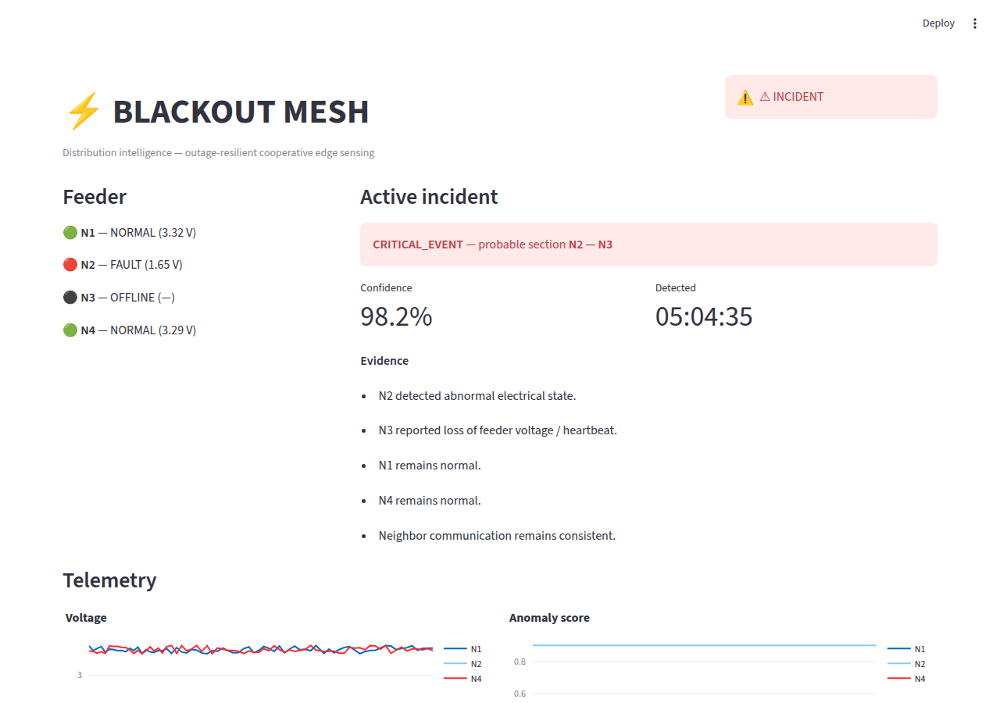

# BLACKOUT MESH

[](https://github.com/raynaagarwal01-rgb/Blackout-Mesh/actions/workflows/ci.yml)

**Low-cost, outage-resilient cooperative edge intelligence for distribution networks.**

> BLACKOUT MESH is a low-cost network of cooperating edge nodes that
> detects abnormal electrical conditions and uses local measurements,
> neighboring-node information, and communication status together to
> estimate which section of a distribution feeder is affected — and
> explains why.

Instead of just reporting "power failure detected," it answers *where
did the problem most likely occur?* and *what evidence points there?*
A node going silent isn't just a communication failure — it's treated
as evidence about where the fault is.

Target build: **₹1,000-1,500, 24 hours, 2 ESP32 boards.** See
`docs/PITCH.md` for the full pitch, novelty statement, and honest
"what this does/doesn't claim" framing.

**Live demo:** [blackout-mesh-cqdey6y4jgs9uxarecjpt6.streamlit.app](https://blackout-mesh-cqdey6y4jgs9uxarecjpt6.streamlit.app/)
— cycles through all 5 scenarios automatically (standalone demo mode,
see `docs/DEPLOYMENT.md`); no hardware attached.



*The dashboard mid-incident during the "feeder interruption" demo scenario (`--scenario interruption`, no hardware needed) — see `docs/DEMO_SCRIPT.md`.*

## Architecture

```text
              +--------------------+
              |  MINI FEEDER       |
              |  5V DC MODEL       |
              +---------+----------+
                        |
            +-----------+-----------+
            |                       |
        +---v---+               +---v---+
        | NODE 1|<-- ESP-NOW -->| NODE 2|   (gateway board, dual role)
        +---+---+               +---+---+
            |                       |
            +-----------+-----------+
                        |
                  SERIAL / USB
                        |
                +-------v-------+
                |  PYTHON GATEWAY |
                | + fault engine  |
                +-------+---------+
                        |
                +-------v-------+
                |    SQLite      |
                +-------+--------+
                        |
                +-------v-------+
                |   STREAMLIT    |
                |   DASHBOARD    |
                +----------------+
```

N3/N4 are filled in as software-emulated ("virtual") nodes so the
dashboard always shows a complete 4-node feeder even with only 2
physical boards — see `docs/HARDWARE.md` for the three budget tiers
(1, 2, or 3 physical ESP32s).

## Quickstart

You can build and test the entire software stack **before any
hardware is wired** — the built-in simulator plays back all four demo
scenarios.

```bash
python3 -m venv .venv && source .venv/bin/activate
pip install -r requirements.txt

# Terminal 1: inference/gateway service (no hardware needed yet)
python backend/run_gateway.py --source simulator --scenario auto

# Terminal 2: dashboard
streamlit run dashboard/app.py
```

Open the URL Streamlit prints (usually http://localhost:8501) and
watch the feeder cycle through normal -> overload -> interruption ->
intermittent -> connectivity-loss every ~8 seconds.

Once your ESP32 boards are flashed (see `firmware/README.md`) and
wired (see `docs/HARDWARE.md`), swap to real hardware:

```bash
python backend/run_gateway.py --source serial --port /dev/ttyUSB0
```

## Repository layout

```text
blackout_mesh/      Shared Python package: config, models, baseline,
                     topology, the fault-localization algorithm,
                     optional ML cross-check, storage, data sources.
backend/             CLI entrypoint (run_gateway.py) that wires a data
                     source (serial or simulator) to the fault engine
                     and SQLite storage.
dashboard/           Streamlit + Plotly live dashboard.
firmware/            Arduino/ESP32 sketches: node, gateway, and a
                     single-board all-in-one simulator variant.
tests/               pytest suite for blackout_mesh/ (algorithm,
                     topology, baseline, simulator, storage).
docs/                HARDWARE.md, ALGORITHM.md, DEMO_SCRIPT.md,
                     PITCH.md, TEAM_PLAN.md.
.github/workflows/   CI: runs the test suite and compiles all three
                     firmware sketches on every push.
```

## Testing & CI

```bash
pip install -r requirements-dev.txt
python -m pytest -q
```

The suite covers the fault-localization algorithm end-to-end against
all five scenarios (normal, overload, interruption, intermittent,
connectivity-loss), the topology/baseline helpers, the simulator, and
SQLite storage round-trips. CI (`.github/workflows/ci.yml`) runs this
on every push, plus a second job that actually compiles all three
firmware sketches against the ESP32 core — catching build-breaking
firmware mistakes before they reach a board.

## Documentation

- `docs/HARDWARE.md` — budget tiers, bill of materials, pin table,
  wiring, safety note.
- `docs/ALGORITHM.md` — how the fault-localization scoring actually
  works, confidence/severity definitions, the optional ML layer.
- `docs/DEMO_SCRIPT.md` — the four demo scenarios and how to trigger
  each one, plus a rehearsal checklist.
- `docs/PITCH.md` — elevator pitch, novelty statement, honest
  scope/limitations, likely judge Q&A.
- `docs/TEAM_PLAN.md` — role split and hour-by-hour 24-hour plan.
- `docs/DEPLOYMENT.md` — deploying the dashboard to Streamlit
  Community Cloud for a hosted, self-contained demo link.
- `firmware/README.md` — flashing instructions and wiring per sketch.

## Safety

This is a **safe, low-voltage DC prototype** — potentiometers stand in
for real voltage/current. Never connect any part of this build to
mains power. See `docs/HARDWARE.md` for details.

## License

[MIT](LICENSE)
